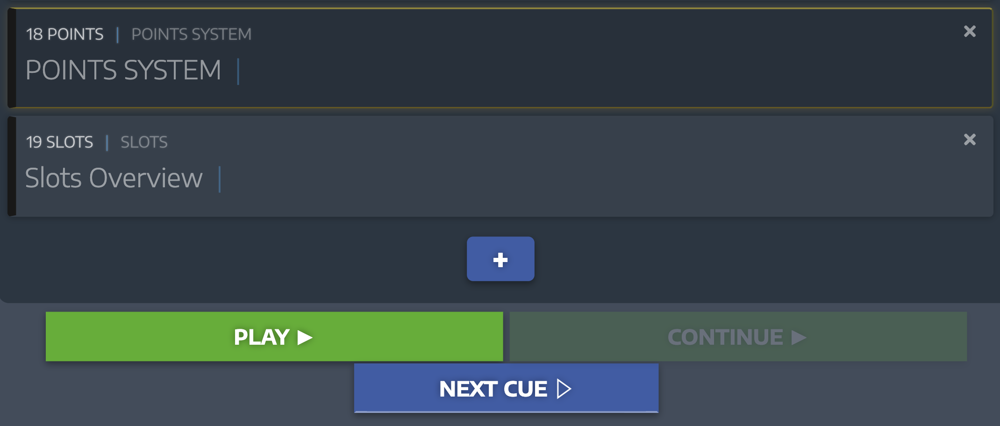

## Cue Controller Plugin for SPX

The Cue Controller Plugin simplifies your rundown management by adding a "Next" button that lets you move through your prepared templates with ease. Once your rundown is set, you can click the "Next" button to automatically stop the current template and start the next one in line, without needing to manually select it. This plugin plays your templates from top to bottom, ensuring a smooth and efficient workflow. Ideal for live productions where quick and precise control over your content is essential.

## Install plugin

if you want to use this plugin you have to buy a licence from [html.graphics](https://html.graphics/)
